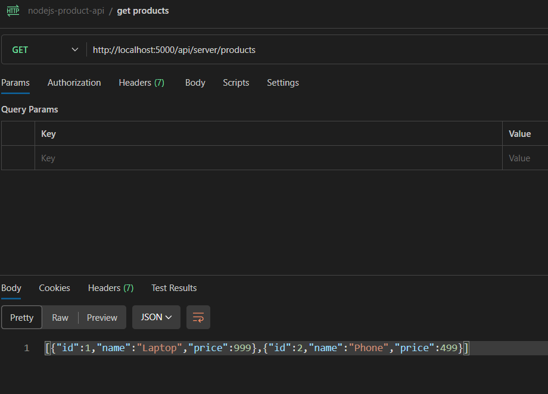
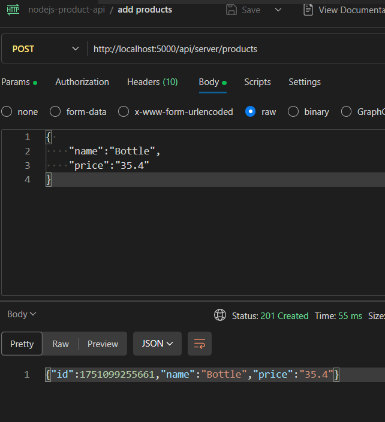
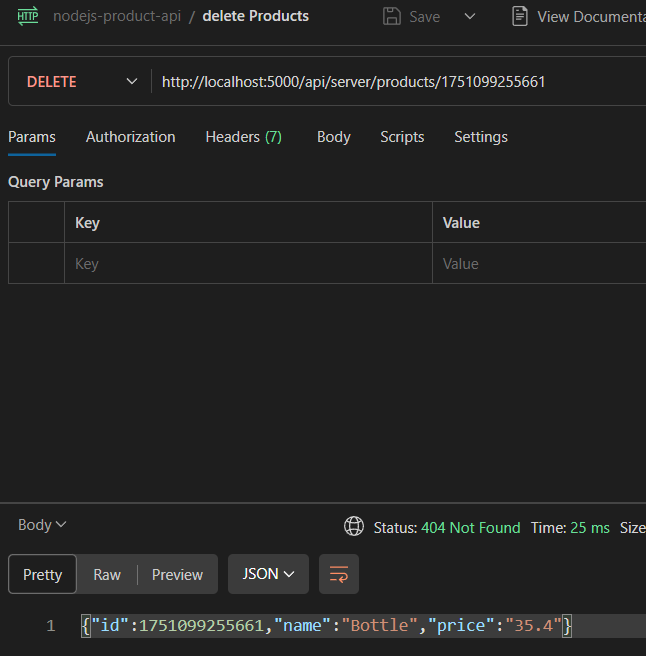

# 🛒 Express Product Management API

This is a simple RESTful API built using **Node.js** and **Express.js** to manage a list of products in-memory. It supports basic CRUD operations like retrieving, adding, and deleting products.

---

## 🚀 Features

- ✅ Get all products
- ✅ Add a new product
- ✅ Delete a product by ID

---

## 🛠️ Technologies Used

- Node.js
- Express.js
- Nodemon (for development)

---

## 📁 Project Structure
```
├── routes
│   └── server.js
├── index.js
└── package.json
```

---

## 📦 Installation

1. **Clone the repository:**

```bash
git clone https://github.com/your-username/express-product-api.git
cd express-product-api
```

2. **Install Dependencies**

```bash
npm install express nodemon
```

3. **Start the server with Nodemon:**

```bash
npx nodemon index.js
```

---

## 🧪 How to Use with Postman

You can use Postman to test this API. Download it here: [https://www.postman.com/downloads/](https://www.postman.com/downloads/)

### 🔍 1. GET All Products

- Method: GET  
- URL: http://localhost:5000/api/server/products  

📸 Example:  


### ➕ 2. POST a New Product

- Method: POST  
- URL: http://localhost:5000/api/server/products  

- Body: raw → JSON

```json
{
  "name": "Tablet",
  "price": 299
}
```

📸 Example:  


### ❌ 3. DELETE a Product

- Method: DELETE  
- URL: http://localhost:5000/api/server/products/:id  

Example: http://localhost:5000/api/server/products/2

📸 Example:  

